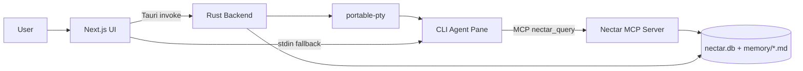
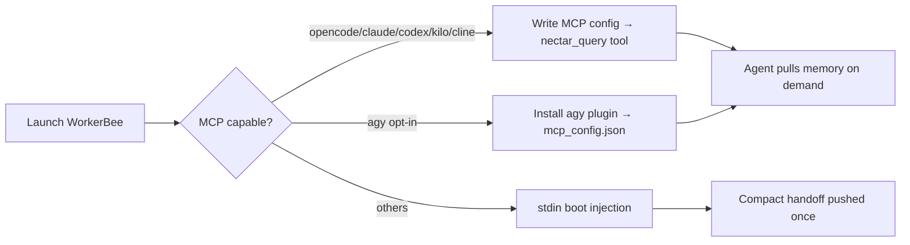
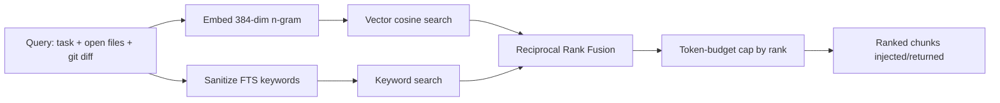

# Hiveory AI

> Project intelligence lives in the project, not in a chat session.

Hiveory AI is a local-first, AI-native desktop dev environment. You open a project, run any supported CLI coding agent (Claude Code, Codex, Aider, Gemini, OpenCode, Cline, Kilo, and more) inside a terminal pane, and every agent automatically reads from and writes to **one shared, project-scoped memory store** — so switching agents mid-project never means starting over.

- **Unified memory (Nectar)** — hybrid vector + keyword search over project knowledge, shared across all agents
- **WorkerBees** — launch CLI coding agents in real terminal panes, wired to memory via MCP or stdin injection
- **Hive shell** — Tauri desktop app with terminal panes, Monaco editor, file explorer, and basic git status/diff
- **Model-agnostic** — swap Claude Code → Codex → Aider without losing context
- **Human-readable memory** — `.nectar/memory/*.md` is plain, git-diffable markdown

## 📑 Table of Contents

- [🚀 How to Use](#-how-to-use)
- [⚙️ Implementation Process](#️-implementation-process)
- [🧰 Tech Stack](#-tech-stack)
- [📦 Setup & Installation](#-setup--installation)
- [🔌 API Endpoints](#-api-endpoints)
- [🗂️ Project Structure](#️-project-structure)
- [📤 Exports](#-exports)
- [⬇️ Download Release Apps](#️-download-release-apps)
- [📄 License](#-license)

## 🚀 How to Use

**1. Open a project** — Launch Hiveory AI and open any project folder. On open, a `.nectar/` memory store is created (or reused) inside that project.

**2. Pick a mode** — The sidebar has two modes:
- **Editor** — file tree + Monaco editor (open/edit/save) with basic git status/diff and an inline terminal.
- **Terminals** — 1 or 2-pane terminal layouts for running agents.

**3. Launch a WorkerBee** — Open a terminal pane and pick a CLI agent (Claude Code, Codex, Aider, Gemini, OpenCode, Cline, Kilo, Kimi, Antigravity). It runs as a normal child process you can type into — Hiveory wires project memory in automatically.

**4. Let memory flow** — For MCP-capable agents, a `nectar_query` tool is registered so the agent pulls ranked memory on demand. For others, a compact handoff summary is injected at boot. A visible `[nectar] memory bridge: ...` line shows which path is active.

**5. Swap agents freely** — Close one agent, open another. It picks up decisions, conventions, and handoffs recorded by the previous agent from the same `.nectar/` — no re-explaining.

**6. Inspect & rebuild** — `.nectar/memory/*.md` is readable markdown. Delete `nectar.db` / `.nectar/index/` and re-index — retrieval rebuilds fully from the markdown alone.

## ⚙️ Implementation Process

Hiveory couples a Tauri (Rust) backend with a Next.js frontend. The hard part is **Nectar**: a hybrid-retrieval memory layer shared by every agent.

**High-level architecture**



**Memory bridge selection (per agent)**



**Hybrid retrieval pipeline (the core logic)**



**Key logic & algorithms**
- **Deterministic embeddings** — a 384-dim character n-gram (uni/bi/tri-gram) hash, L2-normalized, so cosine similarity equals dot product. No external model, identical in Rust and JS.
- **Hybrid search** — vector similarity + keyword search always run together; neither alone is trusted.
- **Reciprocal Rank Fusion (RRF)** — merges the two ranked lists with `score = Σ 1/(k + rank)` (k = 60), avoiding score-scale mismatch.
- **sql.js FTS compatibility** — the JS/MCP side builds an FTS4 mirror and ranks via `matchinfo` (the bundled sql.js lacks FTS5/`bm25`); the Rust side uses native FTS5. Both read the same `nectar.db`.
- **Chunk-level indexing** — memory files are chunked by heading/paragraph, embedded, and upserted incrementally; whole files are never injected.
- **Token-budgeted injection** — chunks are truncated by rank to a token budget (~4k default); below a relevance threshold, nothing is injected.
- **Single source of truth** — all retrieval lives in `@hiveory/nectar`; the MCP server imports it rather than reimplementing it.

## 🧰 Tech Stack

| Layer          | Technology                                                                 |
| -------------- | -------------------------------------------------------------------------- |
| Desktop Shell  | Tauri v2 (Rust)                                                             |
| Frontend       | Next.js (App Router), React, TailwindCSS                                    |
| Frontend State | Zustand (persisted settings)                                               |
| Terminal       | `xterm.js` + `xterm-addon-webgl` / `-fit` / `-search`                      |
| PTY            | `portable-pty` (Rust) via Tauri IPC bridge                                  |
| Editor         | Monaco (`@monaco-editor/react`)                                            |
| Storage        | SQLite — `rusqlite` (Rust) + `sql.js` (Node) → `nectar.db`                 |
| Vector Search  | In-DB embeddings + cosine similarity                                        |
| Keyword Search | SQLite FTS5 (Rust) / FTS4 mirror (Node)                                     |
| Memory Parsing | `gray-matter` + `remark` / `unified`                                        |
| Agent Bridge   | Model Context Protocol (MCP) stdio server + per-CLI config                  |
| Git            | `simple-git` (basic status/diff)                                           |
| Monorepo       | `pnpm` workspaces + Turborepo                                               |
| Language       | TypeScript, Rust                                                            |

## 📦 Setup & Installation

### Prerequisites

- **Node.js** ≥ 20
- **pnpm** ≥ 9 (`npm i -g pnpm`)
- **Rust** toolchain (stable) + Cargo — https://rustup.rs
- **Tauri v2** system dependencies for your OS — https://tauri.app/start/prerequisites
- At least one **CLI coding agent** installed and on PATH (e.g. `npm i -g @anthropic-ai/claude-code`)

### Install & run (development)

```bash
# 1. Install all workspace dependencies
pnpm install

# 2. Build all packages (Nectar, nectar-mcp, Hive frontend)
pnpm build

# 3. Run the desktop app in dev mode (Rust + Next.js hot reload)
cd Hive
pnpm tauri:dev
```

### Frontend only (Next.js dev server)

```bash
cd Hive
pnpm dev
```

### Backend / memory package (standalone)

```bash
# Nectar memory + hybrid search — builds and tests without the desktop app
cd Nectar
pnpm build
pnpm test

# Nectar MCP server (exposes nectar_query over stdio)
cd Nectar/nectar-mcp
pnpm build
```

### Build the desktop app (installers)

```bash
cd Hive
pnpm tauri:build
```

### Configuration & keys

Hiveory AI is **local-first — there are no `.env` files to copy.** Provider API keys (Anthropic, OpenAI, Google, OpenRouter, Moonshot) are entered in the in-app **Settings** panel and stored locally via persisted Zustand state; they are passed to each CLI agent's environment at launch.

## 🔌 API Endpoints

Hiveory AI has no HTTP server. The frontend talks to the Rust backend through **Tauri IPC commands** (`invoke(...)`). Core commands:

| Command                          | Purpose                                             |
| -------------------------------- | --------------------------------------------------- |
| `spawn_terminal`                 | Start a PTY-backed agent/terminal in a pane         |
| `write_to_terminal`              | Send input to a running pane                        |
| `read_from_terminal`             | Read pane output                                     |
| `resize_terminal` / `kill_terminal` | Resize / terminate a pane                         |
| `is_process_alive`               | Check whether a pane's process is running           |
| `read_file` / `write_file`       | Filesystem read/write                                |
| `list_directory`                 | File explorer listing                                |
| `git_status`                     | Basic git status/diff                                |
| `ensure_nectar_structure`        | Create the `.nectar/` layout for a project           |
| `nectar_read_memory_file` / `nectar_write_memory_file` | Read/write memory markdown     |
| `nectar_list_memory_files`       | List memory files                                    |
| `nectar_parse_markdown_to_chunks`| Chunk markdown for indexing                          |
| `nectar_index_file`              | Index a memory file (chunk → embed → upsert)         |
| `nectar_search`                  | Hybrid vector + FTS5 search                          |
| `nectar_inject`                  | Assemble ranked, token-capped context                |
| `nectar_format_context`          | Format context for an agent                          |
| `nectar_log_session`             | Log a session to `.nectar/agents/sessions/`          |
| `get_nectar_mcp_path` / `run_command` / `ensure_dir` | MCP server path / helpers        |

The **Nectar MCP server** additionally exposes one agent-facing tool over stdio: `nectar_query` (args: `task`, optional `open_files`, `git_diff`, `max_chunks`).

## 🗂️ Project Structure

```
hiveory/
├── Hive/                         # Tauri desktop app
│   ├── src/                      # Next.js frontend
│   │   ├── app/                  # App Router pages
│   │   ├── components/
│   │   │   ├── editor/           # Monaco editor + file explorer
│   │   │   ├── terminal/         # xterm panes + layout
│   │   │   └── workerbees/       # CLI agent panes + picker
│   │   ├── stores/               # Zustand stores (settings, workerbees)
│   │   └── lib/                  # Nectar client + Tauri helpers
│   └── src-tauri/                # Rust: PTY, filesystem, Nectar IPC, git
│       ├── src/lib.rs
│       ├── icons/
│       └── tauri.conf.json
│
├── Nectar/                       # Unified memory package (standalone)
│   ├── src/
│   │   ├── db/                   # schema, migrations, sql.js access
│   │   ├── memory/               # read/write .nectar/memory/*.md
│   │   ├── search/               # hybrid retrieval (vector + keyword + RRF)
│   │   ├── injection/            # context assembly + token budgeting
│   │   └── index.ts              # public API
│   └── nectar-mcp/               # MCP server (standalone)
│       ├── src/
│       │   ├── server.ts         # stdio MCP server exposing nectar_query
│       │   ├── tools/            # nectar-query tool (imports @hiveory/nectar)
│       │   └── cli-configs/      # per-CLI config builders (one file per CLI)
│       └── package.json
│
├── pnpm-workspace.yaml
├── turbo.json
└── package.json
```

## 📤 Exports

**`@hiveory/nectar`** (`Nectar/src/index.ts`)
- `Nectar` — top-level class: `create()`, `search()`, `inject()`, `indexFile()`, `reindexAll()`
- `NectarDatabase` — SQLite access layer
- `MemoryManager` — read/write markdown memory
- `SearchEngine` — `vectorSearch`, `keywordSearch`, `hybridSearch`
- `InjectionPipeline` — query building, ranked assembly, token budgeting

**`@hiveory/nectar-mcp`** (`Nectar/nectar-mcp/src/cli-configs/index.ts`)
- `buildCliConfig(cli, spec, options)` — resolve per-CLI MCP config
- `MCP_CAPABLE_CLIS`, `EXPERIMENTAL_MCP_CLIS`
- Per-CLI builders: `opencodeConfig`, `claudeCodeConfig`, `codexConfig`, `kiloCodeConfig`, `clineConfig`, `antigravityConfig`
- `NECTAR_QUERY_TOOL`, `runNectarQuery(projectPath, args)` (from `tools/nectar-query`)

## ⬇️ Download Release Apps

Prebuilt Windows installers (x64) are produced by `pnpm tauri:build` at
`Hive/src-tauri/target/release/bundle/`:

| Installer                              | Type          | Size    |
| -------------------------------------- | ------------- | ------- |
| `Hiveory AI_0.1.0_x64-setup.exe`       | NSIS setup    | ~66 MB  |
| `Hiveory AI_0.1.0_x64_en-US.msi`       | MSI installer | ~68 MB  |

A standalone executable is also available at
`Hive/src-tauri/target/release/hiveory-ai.exe`.

## 📄 License

Open-source (license TBD).
