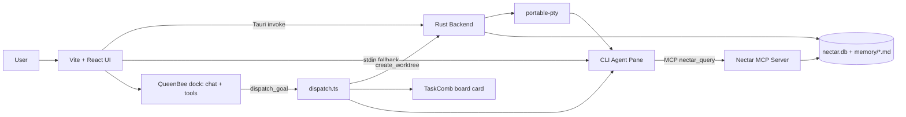
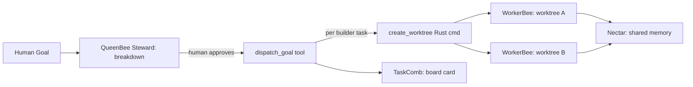
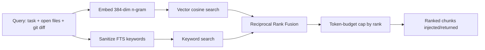

# Hiveory AI v2

> Project intelligence lives in the project, not in a chat session.

Hiveory AI is a local-first, AI-native desktop dev environment. You open a project, run any supported CLI coding agent inside a terminal pane, and every agent automatically reads from and writes to **one shared, project-scoped memory store**. v2 adds **coordination between multiple agents working in parallel** — hand a goal to QueenBee and let a team of agents build it, each in its own isolated worktree, all sharing the same memory.

- **Unified memory (Nectar)** — hybrid vector + keyword search over project knowledge, shared across all agents
- **WorkerBees** — launch CLI coding agents in real terminal panes, wired to memory via MCP or stdin injection
- **Hive shell** — Tauri desktop app: WorkerBee terminal-pane grid, workspace sidebar, QueenBee dock, kanban board, and basic git status
- **Planning (QueenBee)** — conversational Steward/Forager/Stinger modes that break a goal into tasks with declared file ownership, plus tool-calling to act on the app (create workspaces, add/move tasks, launch WorkerBees, dispatch)
- **Agent orchestration (HiveMind)** — standalone Node package: registry, lock management, git worktree isolation, structured handoffs, and a plan/dispatch/approve/review engine (see status note on how it connects to the shell)
- **Kanban board (TaskComb)** — Backlog → Todo → In Progress → Review → Done, custom pointer-based drag & drop
- **Workspaces** — multiple saved project contexts as tabs, each with its own pane layout and running agents
- **Model-agnostic** — swap Claude Code → Codex → Aider without losing context
- **Human-readable memory** — `.nectar/memory/*.md` is plain, git-diffable markdown

> **Implementation status (v2):** The shell, terminal panes, Nectar memory (full Rust-backed read/write/search), the TaskComb board UI, and QueenBee conversational modes (Steward/Forager/Stinger) are wired and working.
>
> **QueenBee tool-calling** is implemented ([`Hive/src/lib/queenbeeTools.ts`](Hive/src/lib/queenbeeTools.ts)): QueenBee can perform UI actions conversationally — create workspaces, add/move tasks, launch WorkerBees, toggle the board — via provider tool-calling (Anthropic + OpenAI formats), gated per mode (Steward acts; Forager/Stinger are read-only auditors).
>
> **Orchestration spine:** the git-worktree isolation the Node-only `@hiveory/hivemind` package couldn't provide to the renderer is now backed by Rust Tauri commands (`create_worktree`/`merge_worktree`/`remove_worktree`), and the renderer dispatch service ([`Hive/src/lib/dispatch.ts`](Hive/src/lib/dispatch.ts)) wires `QueenBee.breakdown()` → worktree → WorkerBee launch → board card, reachable through QueenBee's `dispatch_goal` tool after the human approves.
>
> **Verified** by typecheck, unit tests (`queenbeeTools`, `planDispatch`), and `cargo build`. The full GUI flow (real git worktrees + PTY spawn end-to-end) still needs manual verification in a running desktop build — that path can't be exercised headless.

## 📑 Table of Contents

- [🚀 How to Use](#-how-to-use)
- [⚙️ Implementation Process](#️-implementation-process)
- [🧰 Tech Stack](#-tech-stack)
- [📦 Setup & Installation](#-setup--installation)
- [🔌 API Endpoints](#-api-endpoints)
- [🗂️ Project Structure](#️-project-structure)
- [📤 Exports](#-exports)
- [⬇️ Download Release Apps](#️-download-release-apps)
- [📄 License](#-license)

## 🚀 How to Use

**1. Open a project** — Launch Hiveory AI and open any project folder. On open, a `.nectar/` memory store is created (or reused) inside that project.

**2. The ADE workspace** — Hiveory opens into the ADE (Agent Development Environment): a WorkerBee pane grid for running CLI agents, a workspaces sidebar on the left, a QueenBee conversational dock on the right, and a kanban board drawer. Toggle each via the title bar. (The `git_status` command backs a basic branch/changed-count indicator; a full Monaco editor mode is not currently wired.)

**3. Configure providers** — Open Settings (gear icon in title bar) and navigate to the **Providers** section. Connect API providers (Anthropic, OpenAI, Google, DeepSeek, OpenRouter, or custom OpenAI-compatible endpoints). Each provider is verified by calling its models endpoint — invalid keys, unreachable URLs, and model-not-found errors are distinguished. Connected providers populate the **Models** section for app-wide selection.

**4. Launch a WorkerBee** — In ADE mode, open a terminal pane and pick a CLI agent (OpenCode, Claude Code, Codex, Cline, Kilo, Antigravity, or others). It runs as a normal child process you can type into — Hiveory wires project memory in automatically. A `[nectar] memory bridge: ...` line shows which path is active.

**5. Let memory flow** — For MCP-capable agents, a `nectar_query` tool is registered so the agent pulls ranked memory on demand. For others, a compact handoff summary is injected at boot. A visible role badge and branch indicator appears on panes that belong to an active mission.

**6. Coordinate multiple agents (v2)** — Talk to QueenBee in the right-side conversational dock. QueenBee (Steward mode) breaks a goal into tasks with declared file ownership. Once you approve, its `dispatch_goal` tool creates an isolated git worktree per builder task (via the `create_worktree` Rust command), launches a WorkerBee in each, and drops a board card. Track progress via the Board drawer (button in the ADE toolbar, slides in with a clip-path animation). Cards can be dragged across columns with custom pointer-based drag & drop (threshold-gated at 5px, with floating preview and drop indicator). Every agent reads/writes the same Nectar memory. (Reviewer diff/approve/merge exists as backend commands — `merge_worktree` — but the reviewer UI loop is not yet wired; see the status note above.)

**7. Workspaces** — Click the Workspaces button in the ADE toolbar to open the side panel. Create multiple workspaces (each with its own project folder, pane layout, and running agents). Each workspace shows inline agent status badges (launching/running/idle/error/done) and task card counts. Switching workspaces routes the pane grid to that workspace's WorkerBees — agents in non-active workspaces keep running in the background (per-workspace pane-state routing).

**8. Swap agents freely** — Close one agent, open another. It picks up decisions, conventions, and handoffs recorded by the previous agent from the same `.nectar/` — no re-explaining.

**9. Inspect & rebuild** — `.nectar/memory/*.md` is readable markdown. Delete `nectar.db` / `.nectar/index/` and re-index — retrieval rebuilds fully from the markdown alone.

## ⚙️ Implementation Process

Hiveory couples a Tauri (Rust) backend with a Vite + React frontend. The hard part is **Nectar**: a hybrid-retrieval memory layer shared by every agent.

**High-level architecture**



**v2 Multi-agent orchestration flow** (as wired in the shell)



> The richer engine in `@hiveory/hivemind` (Lock Registry conflict checks, Reviewer diff → `merge_worktree` cleanup, handoff files) is implemented and unit-tested as a standalone Node package, but is not yet the code path the shell runs — the renderer drives dispatch directly through Rust worktree commands. Wiring the full Orchestrator/Reviewer loop into the app is the next milestone.

**Memory bridge selection (per agent)**


**Hybrid retrieval pipeline (the core logic)**



**Key logic & algorithms**
- **Deterministic embeddings** — a 384-dim character n-gram (uni/bi/tri-gram) hash, L2-normalized, so cosine similarity equals dot product. No external model, identical in Rust and JS.
- **Hybrid search** — vector similarity + keyword search always run together; neither alone is trusted.
- **Reciprocal Rank Fusion (RRF)** — merges the two ranked lists with `score = Σ 1/(k + rank)` (k = 60), avoiding score-scale mismatch.
- **sql.js FTS compatibility** — the JS/MCP side builds an FTS4 mirror and ranks via `matchinfo` (the bundled sql.js lacks FTS5/`bm25`); the Rust side uses native FTS5. Both read the same `nectar.db`.
- **Chunk-level indexing** — memory files are chunked by heading/paragraph, embedded, and upserted incrementally; whole files are never injected.
- **Token-budgeted injection** — chunks are truncated by rank to a token budget (~4k default); below a relevance threshold, nothing is injected.
- **Single source of truth** — all retrieval lives in `@hiveory/nectar`; the MCP server imports it rather than reimplementing it.

## 🧰 Tech Stack

| Layer                   | Technology                                                               |
| ----------------------- | ------------------------------------------------------------------------ |
| Desktop Shell           | Tauri v2 (Rust)                                                           |
| Frontend                | Vite + React, TailwindCSS                                                 |
| Frontend State          | Zustand (settings + providers persisted via `zustand/middleware`; workspaces in-memory) |
| Terminal                | `xterm.js` + `xterm-addon-webgl` / `-fit` / `-search`                    |
| PTY                     | `portable-pty` (Rust) via Tauri IPC bridge                                |
| Storage                 | SQLite — `rusqlite` (Rust) + `sql.js` (Node) → `nectar.db`               |
| Vector Search           | In-DB embeddings + cosine similarity                                      |
| Keyword Search          | SQLite FTS5 (Rust) / FTS4 mirror (Node)                                   |
| Memory Parsing          | `gray-matter` + `remark` / `unified`                                      |
| Agent Bridge            | Model Context Protocol (MCP) stdio server + per-CLI config                |
| Git Worktree Isolation  | `git worktree` via Rust `std::process::Command` (Tauri commands)          |
| Kanban                  | Native React components with custom pointer-based drag & drop             |
| Tests                   | Vitest (per package + Hive `src/lib`)                                     |
| Git                     | `simple-git` (basic status/diff)                                          |
| Monorepo                | `pnpm` workspaces + Turborepo                                             |
| Language                | TypeScript, Rust                                                          |

## 📦 Setup & Installation

### Prerequisites

- **Node.js** ≥ 20
- **pnpm** ≥ 9 (`npm i -g pnpm`)
- **Rust** toolchain (stable) + Cargo — https://rustup.rs
- **Tauri v2** system dependencies for your OS — https://tauri.app/start/prerequisites
- At least one **CLI coding agent** installed and on PATH (e.g. `npm i -g @anthropic-ai/claude-code`)

### Install & run (development)

```bash
# 1. Install all workspace dependencies
pnpm install

# 2. Build all packages (Nectar, nectar-mcp, HiveMind, QueenBee, TaskComb, Hive frontend)
pnpm turbo build

# 3. Run the desktop app in dev mode (Rust + Next.js hot reload)
cd Hive
pnpm tauri:dev
```

### Frontend only (Next.js dev server)

```bash
cd Hive
pnpm dev
```

### Standalone package development

```bash
# Nectar memory + hybrid search
cd Nectar
pnpm build
pnpm test

# Nectar MCP server (exposes nectar_query over stdio)
cd Nectar/nectar-mcp
pnpm build

# HiveMind orchestration (v2)
cd HiveMind
pnpm build
pnpm test

# QueenBee planning (v2)
cd QueenBee
pnpm build
pnpm test

# WorkerBees adapters + launcher (standalone)
cd WorkerBees
pnpm build
pnpm test

# TaskComb kanban (v2)
cd TaskComb
pnpm build
pnpm test

# Or build all at once from the root
pnpm turbo build
pnpm turbo test
```

### Build the desktop app (installers)

```bash
cd Hive
pnpm tauri:build
```

### Configuration & keys

Hiveory AI is **local-first — there are no `.env` files to copy.** Provider API keys (Anthropic, OpenAI, Google, OpenRouter, Moonshot) are entered in the in-app **Settings** panel and stored locally via persisted Zustand state; they are passed to each CLI agent's environment at launch.

## 🔌 API Endpoints

Hiveory AI has no HTTP server. The frontend talks to the Rust backend through **Tauri IPC commands** (`invoke(...)`). Core commands:

| Command                          | Purpose                                             |
| -------------------------------- | --------------------------------------------------- |
| `spawn_terminal`                 | Start a PTY-backed agent/terminal in a pane         |
| `write_to_terminal`              | Send input to a running pane                        |
| `read_from_terminal`             | Read pane output                                     |
| `resize_terminal` / `kill_terminal` | Resize / terminate a pane                         |
| `is_process_alive`               | Check whether a pane's process is running           |
| `read_file` / `write_file`       | Filesystem read/write                                |
| `list_directory`                 | File explorer listing                                |
| `git_status`                     | Basic git status (branch + changed-file count)       |
| `create_worktree`                | Create an isolated git worktree + `agent/<task>` branch for a task |
| `merge_worktree`                 | Merge an agent branch back, then remove its worktree |
| `remove_worktree`                | Remove a worktree (force)                            |
| `ensure_nectar_structure`        | Create the `.nectar/` layout for a project           |
| `nectar_read_memory_file` / `nectar_write_memory_file` | Read/write memory markdown     |
| `nectar_list_memory_files`       | List memory files                                    |
| `nectar_parse_markdown_to_chunks`| Chunk markdown for indexing                          |
| `nectar_index_file`              | Index a memory file (chunk → embed → upsert)         |
| `nectar_search`                  | Hybrid vector + FTS5 search                          |
| `nectar_inject`                  | Assemble ranked, token-capped context                |
| `nectar_format_context`          | Format context for an agent                          |
| `nectar_log_session`             | Log a session to `.nectar/agents/sessions/`          |
| `get_nectar_mcp_path` / `run_command` / `ensure_dir` | MCP server path / helpers        |

The **Nectar MCP server** additionally exposes one agent-facing tool over stdio: `nectar_query` (args: `task`, optional `open_files`, `git_diff`, `max_chunks`).

## 🗂️ Project Structure

```
hiveory/
├── Hive/                         # Tauri desktop app
│   ├── src/                      # Vite + React frontend
│   │   ├── main.tsx              # React entry (renders HomePage)
│   │   ├── app/                  # HomePage (ADE shell)
│   │   ├── components/
│   │   │   ├── ade/              # ADE docks: worktree sidebar, right dock, session history
│   │   │   ├── queenbee/         # QueenBee conversational chat (Steward/Forager/Stinger)
│   │   │   ├── settings/         # Settings page: ProvidersSection + ModelsSection
│   │   │   ├── terminal/         # xterm panes + layout
│   │   │   ├── workerbees/       # CLI agent panes + picker + RoleBadge
│   │   │   └── workspace/        # Workspaces side panel + tab strip
│   │   ├── stores/               # Zustand stores (settings, workerbees, workspaces, providers, project)
│   │   └── lib/                  # Nectar client, Tauri helpers, queenbeeTools, dispatch
│   └── src-tauri/                # Rust: PTY, filesystem, Nectar IPC, git + worktree
│       ├── src/lib.rs
│       ├── icons/
│       └── tauri.conf.json
│
├── HiveMind/                     # Agent orchestration (v2, standalone)
│   ├── src/
│   │   ├── registry/             # Agent registry: track WorkerBees per task
│   │   ├── locks/                # File-ownership lock registry (advisory)
│   │   ├── worktree/             # Git worktree create/remove wrapper
│   │   ├── handoffs/             # Structured handoff files per task
│   │   ├── roles/                # Role definitions (Coordinator/Builder/Scout/Reviewer)
│   │   ├── orchestrator.ts       # Plan/dispatch/approve/reject engine
│   │   └── index.ts              # Public API
│   └── tests/
│
├── QueenBee/                     # AI planning (v2, standalone)
│   ├── src/
│   │   ├── breakdown.ts          # Goal → task list (LLM prompt + template)
│   │   ├── assignment.ts         # Task → role + CLI assignment
│   │   ├── tracking.ts           # Task progress state machine
│   │   ├── review-routing.ts     # Reviewer feedback routing
│   │   └── index.ts
│   └── tests/
│
├── TaskComb/                     # Kanban board (v2, standalone)
│   ├── src/
│   │   ├── board.ts              # Column state + card CRUD
│   │   ├── dispatch.ts           # Build a dispatch command from a card
│   │   ├── components/           # React board UI: TaskCombDrawer/LaneGrid/StatusLane/Card + drag & drop hooks
│   │   └── index.ts
│   └── tests/
│
├── Nectar/                       # Unified memory package (standalone)
│   ├── src/
│   │   ├── db/                   # schema, migrations, sql.js access
│   │   ├── memory/               # read/write .nectar/memory/*.md
│   │   ├── search/               # hybrid retrieval (vector + keyword + RRF)
│   │   ├── injection/            # context assembly + token budgeting
│   │   └── index.ts              # public API
│   └── nectar-mcp/               # MCP server (standalone)
│       ├── src/
│       │   ├── server.ts         # stdio MCP server exposing nectar_query
│       │   ├── tools/            # nectar-query tool (imports @hiveory/nectar)
│       │   └── cli-configs/      # per-CLI config builders (one file per CLI)
│       └── package.json
│
├── WorkerBees/                   # CLI agent adapters + launcher (standalone)
│   ├── src/
│   │   ├── adapters/             # Per-CLI adapter implementations (10 agents)
│   │   ├── cli-configs/          # MCP config builders per CLI
│   │   ├── launcher.ts           # WorkerBeeLauncher — Nectar injection + session management
│   │   ├── types.ts              # WorkerBeeAdapter interface + shared types
│   │   └── index.ts
│   └── tests/
│
├── pnpm-workspace.yaml
├── turbo.json
└── package.json
```

## 📤 Exports

**`@hiveory/nectar`** (`Nectar/src/index.ts`)
- `Nectar` — top-level class: `create()`, `search()`, `inject()`, `indexFile()`, `reindexAll()`
- `NectarDatabase` — SQLite access layer
- `MemoryManager` — read/write markdown memory
- `SearchEngine` — `vectorSearch`, `keywordSearch`, `hybridSearch`
- `InjectionPipeline` — query building, ranked assembly, token budgeting

**`@hiveory/nectar-mcp`** (`Nectar/nectar-mcp/src/cli-configs/index.ts`)
- `buildCliConfig(cli, spec, options)` — resolve per-CLI MCP config
- `MCP_CAPABLE_CLIS`, `EXPERIMENTAL_MCP_CLIS`
- Per-CLI builders: `opencodeConfig`, `claudeCodeConfig`, `codexConfig`, `kiloCodeConfig`, `clineConfig`, `antigravityConfig`
- `NECTAR_QUERY_TOOL`, `runNectarQuery(projectPath, args)` (from `tools/nectar-query`)

**`@hiveory/hivemind`** (`HiveMind/src/index.ts`) — v2, Node-only (uses `child_process`/`fs`)
- `HiveMind` — the only exported value; a top-level class exposing `create()` and readonly instance fields below. Also exports its types (`Role`, `AgentRecord`, `AgentStatus`, `LockConflict`, `HandoffEntry`, `WorktreeInfo`).
- `.registry` — `AgentRegistry`: track WorkerBees, status lifecycle, mission queries
- `.locks` — `LockRegistry`: advisory file-ownership conflict detection
- `.worktree` — `WorktreeManager`: `git worktree add/remove/merge-and-remove` wrapper
- `.handoffs` — `HandoffManager`: read/write `.nectar/agents/handoffs/<task>.md`
- `.roles` — `RoleManager`: four fixed roles (Coordinator, Builder, Scout, Reviewer)
- `.orchestrator` — `Orchestrator`: `plan()`, `dispatch()`, `complete()`, `approve()`, `reject()`

> Note: because this package imports `node:child_process`/`node:fs`, it cannot run in the Tauri renderer. The shell's dispatch path uses Rust worktree commands + `Hive/src/lib/dispatch.ts` instead (see status note).

**`@hiveory/queenbee`** (`QueenBee/src/index.ts`) — v2
- `breakdown()` / `templateBreakdown()` — goal → task list with owns/reads/depends-on
- `buildBreakdownPrompt()` — LLM prompt template for Nectar-aware breakdown
- `DefaultAssignmentStrategy` — task → role + CLI assignment
- `ProgressTracker` — task status lifecycle (backlog → done)
- `ReviewRouter` — approval/rejection routing (reassign/retry/complete)
- `MODE_SYSTEM_PROMPTS` / `detectModeIntent()` / `MODE_LABELS` — Steward/Forager/Stinger mode prompts + intent routing (single-sourced here; the Hive chat imports them rather than re-declaring)

**`@hiveory/taskcomb`** (`TaskComb/src/index.ts`) — v2
- `Board` — kanban state: `addCard()`, `moveCard()`, `getCardsByColumn()`
- `DefaultDispatchResolver` — resolve project path, CLI, worktree dir from a card
- `buildDispatchCommand()` — produce the HiveMind dispatch command for a card

**`@hiveory/worker-bees`** (`WorkerBees/src/index.ts`) — restored standalone package
- `WorkerBeeLauncher` — `launch()`, `endSession()`, `getActiveSessions()`
- `WorkerBeeAdapter` — adapter interface for per-CLI logic (`getCommand`, `onSessionEnd`, `formatContext`)
- 10 adapters: `OpenCodeAdapter`, `ClaudeCodeAdapter`, `CodexAdapter`, `KiloAdapter`, `ClineAdapter`, `AntigravityAdapter`, `AiderAdapter`, `KimiCodeAdapter`, `CursorAdapter`, `KiroAdapter`
- `buildCliConfig(cli, spec, options)` — resolve per-CLI MCP config (re-exported from `cli-configs/`)

## ⬇️ Building Release Apps

No prebuilt binaries are published yet. Running `pnpm tauri:build` (from `Hive/`)
produces Windows installers under `Hive/src-tauri/target/release/bundle/`:

| Output                                 | Type          |
| -------------------------------------- | ------------- |
| `Hiveory AI_<version>_x64-setup.exe`   | NSIS setup    |
| `Hiveory AI_<version>_x64_en-US.msi`   | MSI installer |

The standalone executable is at `Hive/src-tauri/target/release/hiveory-ai.exe`.

## 📄 ADE Redesign — changelog

Key changes in the ADE (Agent Development Environment) UI/UX pass:

| Change | Where |
|---|---|
| Kanban board rendered as a slide-out drawer with a `clip-path` animation | `TaskComb/src/components/`: `TaskCombDrawer`, `TaskCombLaneGrid`, `TaskCombStatusLane`, `TaskCombCard`, `TaskCombDrawerHeader` |
| Custom pointer-based drag & drop (5px threshold, floating preview, drop indicator) | `TaskComb/src/components/use-taskcomb-card-pointer-drag.ts` |
| Multi-selection (click/shift/cmd) and pointer/keyboard column resize | `use-taskcomb-selection.ts`, `use-taskcomb-column-resize.ts` |
| Board open/close/drag-preview state machine | `useTaskCombBoardPanel.ts` |
| Per-workspace WorkerBee state routing (switch workspace → switch grid) | `WorkerBeesPanel.tsx`, `HomePage.tsx`, `workspaceStore.ts`, `workerBeesStore.ts` |
| Task card model with `sortOrder`, `owns`, `reads`, `dependsOn`, `blockingReason` | `TaskComb/src/board.ts` (canonical type), consumed by `workspaceStore.ts` |
| Left sidebar: flat one-row-per-workspace list with live-status dot, inline rename, branch label, search + filter, resizable (220–500px) | `Hive/src/components/ade/ADEWorktreeSidebar.tsx` |
| Right dock: QueenBee chat + Agent Session History merged into Chat/History sub-tabs | `ADERightDock.tsx`, `ADESessionHistory.tsx` |
| Backend `nectar_list_sessions` command — reads `.nectar/agents/sessions/*.md`, parses frontmatter, returns sorted/filtered entries | `Hive/src-tauri/src/lib.rs`, `Hive/src/lib/nectar.ts` |
| Git worktree isolation commands (`create_worktree`/`merge_worktree`/`remove_worktree`) + renderer dispatch | `Hive/src-tauri/src/lib.rs`, `Hive/src/lib/dispatch.ts` |
| QueenBee tool-calling (create workspace, add/move task, launch WorkerBee, dispatch) | `Hive/src/lib/queenbeeTools.ts` |

## 📄 License

Open-source (license TBD).
