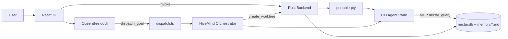
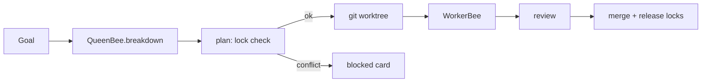

# Hiveory

> Project intelligence lives in the project, not in a chat session.

Hiveory is a local-first, AI-native desktop dev environment. Run any CLI coding agent in a terminal pane; every agent reads and writes **one shared, project-scoped memory store**, so switching tools never loses context. Hand a goal to QueenBee and a team of agents builds it in parallel — each in its own git worktree, coordinated by file-ownership locks.

- **Shared memory (Nectar)** — hybrid vector + keyword retrieval over `.nectar/memory/*.md`, injected into every agent.
- **WorkerBees** — launch Claude Code, Codex, OpenCode, Aider, and more in real PTY panes.
- **QueenBee** — conversational planner that breaks a goal into tasks and dispatches agents via tool-calling.
- **Plane workspace** — one surface at a time: WorkerBees, Terminal, Browser, CoWorkers, or Android Emulator.
- **Browser + Emulator panes** — CDP localhost preview with agent-readable screenshots; build/boot Android AVDs.
- **Local voice** — whisper.cpp dictation, no API key, with in-app push-to-talk hotkeys.

## 📑 Table of Contents

- [🚀 How to Use](#-how-to-use)
- [🧠 Implementation Overview](#-implementation-overview)
- [🛠️ Tech Stack](#️-tech-stack)
- [⚙️ Setup & Installation](#️-setup--installation)
- [📁 Project Structure](#-project-structure)
- [📦 Exports](#-exports)
- [⬇️ Downloads](#️-downloads)
- [📄 License](#-license)

## 🚀 How to Use

- **Open a project** — a `.nectar/` memory store is created (or reused) in the folder.
- **Pick a plane** from the title bar, then use its `+` to add panes: launch a CLI agent (WorkerBees), a shell (Terminal), a CDP browser, or an Android emulator.
- **Dispatch with QueenBee** — describe a goal in the right dock; Steward breaks it into tasks with declared file ownership, creates a git worktree per builder, launches an agent in each, and tracks them on the Task Comb board.
- **Preview & test** — the Browser pane loads your localhost dev server; QueenBee can screenshot it. The Emulator pane builds an immutable AVD (device, RAM, storage) and boots it.
- **Voice** — click the mic in QueenBee to dictate; or push-to-talk: hold **Ctrl+Win** to type into the focused field, **Win+Alt** to dictate into QueenBee.

## 🧠 Implementation Overview

Each root folder is a standalone package that owns its domain; **Hive borrows, never re-implements**. Side effects that a browser can't do (git, fs, PTY) go through typed ports, with Tauri-backed adapters supplied by Hive.



- **Hybrid retrieval** — query is embedded as a deterministic 384-dim char n-gram (identical in Rust and JS), fused with SQLite FTS via Reciprocal Rank Fusion, then token-budget capped. See [`Nectar/src/search`](Nectar/src/search).
- **Orchestration** — `HiveMind.Orchestrator` runs file-ownership lock checks before dispatch and merges branches on approve. Pure core stays free of `node:` imports (enforced by a test); Hive injects adapters in [`hivemindAdapters.ts`](Hive/src/features/orchestration/hivemindAdapters.ts).



- **Pure card + AVD logic** — board ordering ([`TaskComb/src/cards.ts`](TaskComb/src/cards.ts)) and Android `config.ini` generation ([`Hive/src/features/emulator/android/avd.ts`](Hive/src/features/emulator/android/avd.ts)) are pure and unit-tested.

## 🛠️ Tech Stack

| Category | Technology | Purpose |
| --- | --- | --- |
| Desktop shell | Tauri v2 (Rust) | native window, IPC, process/filesystem access |
| Frontend | React + Vite + TailwindCSS + Zustand | UI, panes, state |
| Terminal | `xterm.js` + `portable-pty` | agent & shell panes over a PTY |
| Memory store | SQLite (`rusqlite` / `sql.js`) + FTS5 | Nectar hybrid retrieval |
| Agent bridge | Model Context Protocol (stdio) | exposes `nectar_query` to CLIs |
| Orchestration | `@hiveory/hivemind` | git worktrees, file locks, dispatch/approve |
| Browser pane | Chrome DevTools Protocol | localhost preview + screenshots |
| Emulator | Android SDK (`emulator` / `adb`) | build + boot AVDs |
| Voice | whisper.cpp + WebAudio | local, offline dictation |
| Monorepo | `pnpm` workspaces + Turborepo | TypeScript + Rust |
| Tests | Vitest | per-package unit tests |

## ⚙️ Setup & Installation

**Prerequisites**

- Node.js ≥ 20
- pnpm ≥ 9 (`npm i -g pnpm`)
- Rust (stable) + Cargo — https://rustup.rs
- [Tauri v2 system dependencies](https://tauri.app/start/prerequisites) for your OS
- At least one CLI coding agent on PATH (e.g. `npm i -g @anthropic-ai/claude-code`)
- Optional: Android SDK (`emulator` + `platform-tools`) for the Emulator plane

Provider API keys are entered in the in-app Settings panel and stored locally — there are no `.env` files.

**Install & run**

```bash
pnpm install
pnpm turbo build
cd Hive && pnpm tauri:dev
```

**Build installers**

```bash
cd Hive && pnpm tauri:build
```

## 📁 Project Structure

```text
Hiveory/
├── Hive/                     # Tauri desktop app
│   ├── src/
│   │   ├── app/              # HomePage shell (title bar, planes, docks)
│   │   ├── features/         # one folder per feature (owns UI + store + tests)
│   │   │   ├── panes/        # plane host + switcher
│   │   │   ├── worker-bees/  # CLI agent panes
│   │   │   ├── terminal/     # shell panes (xterm)
│   │   │   ├── browser/      # CDP browser pane
│   │   │   ├── emulator/     # Android AVD build + panes
│   │   │   ├── queenbee/     # planner chat + tools
│   │   │   ├── orchestration/# dispatch + HiveMind adapters
│   │   │   ├── task-comb/    # mission board
│   │   │   ├── voice/        # whisper dictation + hotkeys
│   │   │   ├── memory/ · sessions/ · settings/ · workspaces/ · dock/
│   │   └── shared/           # cross-feature: tauri, stores, logo
│   └── src-tauri/            # Rust: PTY, fs, git/worktree, CDP, emulator, whisper
├── Nectar/                   # memory: DB, retrieval, injection
│   └── nectar-mcp/           # MCP stdio server (nectar_query)
├── HiveMind/                 # orchestration engine (registry, locks, worktrees)
├── QueenBee/                 # planning: breakdown, assignment, review routing
├── TaskComb/                 # board/pipeline state + React UI
├── WorkerBees/               # per-CLI adapters + launcher
├── BeeVoice/                 # local voice layer (whisper.cpp, injectable ports)
├── pnpm-workspace.yaml
└── turbo.json
```

## 📦 Exports

Consumed by Hive via `workspace:*`. Each ships a pure entry; Node-only engines sit behind a `/core` subpath where noted.

| Package | Key exports |
| --- | --- |
| `@hiveory/nectar` | `Nectar`, `SearchEngine`, `InjectionPipeline` |
| `@hiveory/nectar-mcp` | `buildCliConfig`, `runNectarQuery`, `NECTAR_QUERY_TOOL` |
| `@hiveory/hivemind` (`/core`) | `Orchestrator`, `AgentRegistry`, `LockRegistry`, `RoleManager`, `WorktreeOps` |
| `@hiveory/queenbee` | `breakdown`, `DefaultAssignmentStrategy`, `ReviewRouter`, `MODE_SYSTEM_PROMPTS` |
| `@hiveory/taskcomb` | `Board`, `addCard`/`moveCard`, `PipelineBoard`, `buildPipeline` |
| `@hiveory/worker-bees` | `WorkerBeeLauncher`, `CLI_METADATA`, `buildCliConfig` |
| `@hiveory/bee-voice` (`/core`) | `BeeVoice`, `STTEngine`, `AudioRecorder`, `WhisperCppEngine` |

## ⬇️ Downloads

No prebuilt binaries are published. `cd Hive && pnpm tauri:build` produces Windows installers under `Hive/src-tauri/target/release/bundle/`:

| Installer | Path |
| --- | --- |
| NSIS setup | `nsis/Hiveory AI_<version>_x64-setup.exe` |
| MSI | `msi/Hiveory AI_<version>_x64_en-US.msi` |

## 📄 License

Personal, non-commercial use only — see [LICENSE](LICENSE). Commercial use is not permitted; contact raktimyoddha07@gmail.com for a commercial license.
